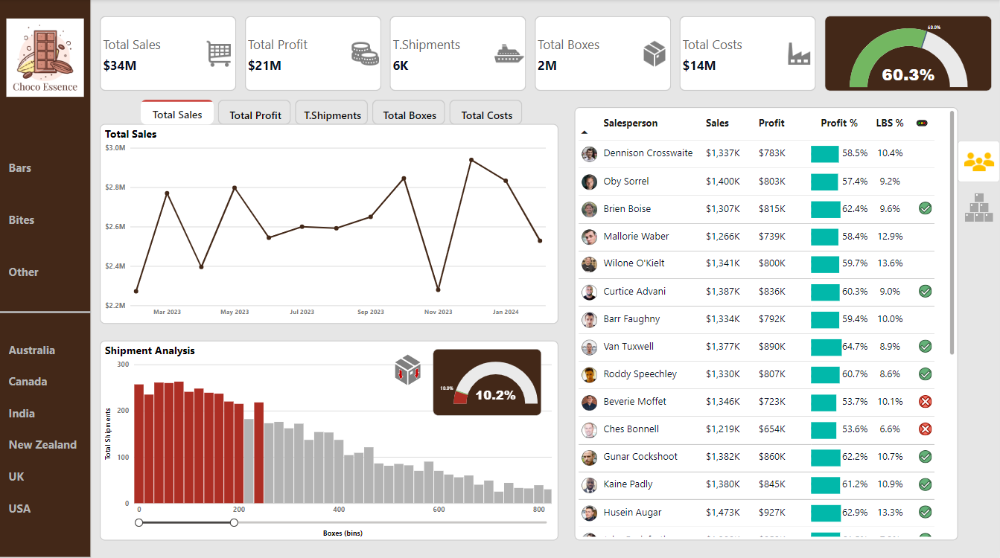

# Introduction
 _End-to-end Portfolio Project: From Data Modelling to Interactive Power BI Sales Dashboard_

### Project Overview:
This project involved analyzing sales data for the fictional chocolate brand "Choco Essence" using Microsoft Power BI. The data was sourced from [Chandoo.org](https://chandoo.org/) and was explored to gain insights into sales performance.

🗃️ Files:
- [The Dataset](essence_ch-sample-data.xlsx) 
- [Custom-made logo](Choco_Essence_logo.png)

🧩 See the full dashboard here - [App Power BI link](https://app.powerbi.com/view?r=eyJrIjoiODE0N2IxNzUtZTYyZC00YWYyLTgwMGUtNGVhYWQzZDZkM2NhIiwidCI6IjU5NTNiNjc5LWUzMGMtNGRjNi05MmU5LTZlNzUzMjkwOTQ3YyIsImMiOjN9)

  
### 👩‍💻 Key Actions Performed: Data Transformation – Modeling – Visualization – EDA
- Utilized **Power Query** to transform the data, handling inconsistencies or missing values and creating new calculated columns for "Sales" and "Qty Sold"
- Conducted data modeling in **Power BI**, focusing on table relationships and star-schema development
- Identified **KPIs for sales analytics** such as Total Sales, Shipments, MoM Profit Change, and Cost Change
- Developed over **16 measures** and established a dedicated measure table
- Explored the power of **Calculation Groups** to automate repetitive calculations consistently across all relevant measures
- Created a **Field Parameter** called “Measure Selector” for dynamic use in trend charts
- Leveraged the **Group** feature to bin shipment data and visualized it in a histogram, enhanced with an interactive **Zoom Slider** for dynamic exploration
- Applied **Conditional Formatting** to tables to highlight insights and improve readability
- Implemented **Bookmarks** for streamlined navigation, offering quick access to key insights across salesperson and product tables
- Configured **Tooltips** for detailed country-wise sales breakdowns.

### 🔍 A Closer Look at the Dashboard Visualizations:
The interactive dashboard includes a variety of visualizations and slicers to analyze sales performance.

- **The slicers** on the left side allow for filtering data by **Product Category** or **Country**.
- **Dynamic Trend Analysis**: A line chart using Field Parameters to toggle between different KPIs such as sales, profit, and shipments
- **Shipment Analysis**: A histogram with a Zoom Slider, showing the distribution of shipments by box size
- **Gauge Chart**: Displays the percentage of large box shipments (**LBS%**) for tracking shipment trends
- **Dynamic Cards & Tabs**: Cards presenting total sales, profit, shipments, and costs, with selectable tabs to view additional KPIs
- **Salesperson & Product Performance Analysis**: Visuals enhanced by bookmarks to switch between performance metrics, featuring conditional formatting to highlight top-performing salespeople and best-selling products.

### 🛠 Tools and Technologies:
- **Microsoft Power BI**
- **Power Query**
- **Microsoft Excel**

### 💡 Key Achievements:

- Uncovered **actionable insights** into the **sales dynamics of Choco Essence**, illuminating performance trends across diverse product categories and geographical regions
- Recognized **top-performing salespeople**, celebrating their contributions while uncovering sales patterns that drive future strategies. Identified **best-selling products** within the portfolio, highlighting their dynamics and contributions to **revenue and profitability**
- Conducted an in-depth **performance analysis**, pinpointing opportunities for improvement and highlighting success in achieving targets, paving the way for enhanced sales strategies.

##### Acknowledgements & Inspiration:
This project was inspired by resources and tutorials from Chandoo.org, a fantastic platform dedicated to helping people become awesome in Excel, Power BI, and data visualization. Special thanks to the Chandoo community for their invaluable insights and guidance throughout the learning process.
